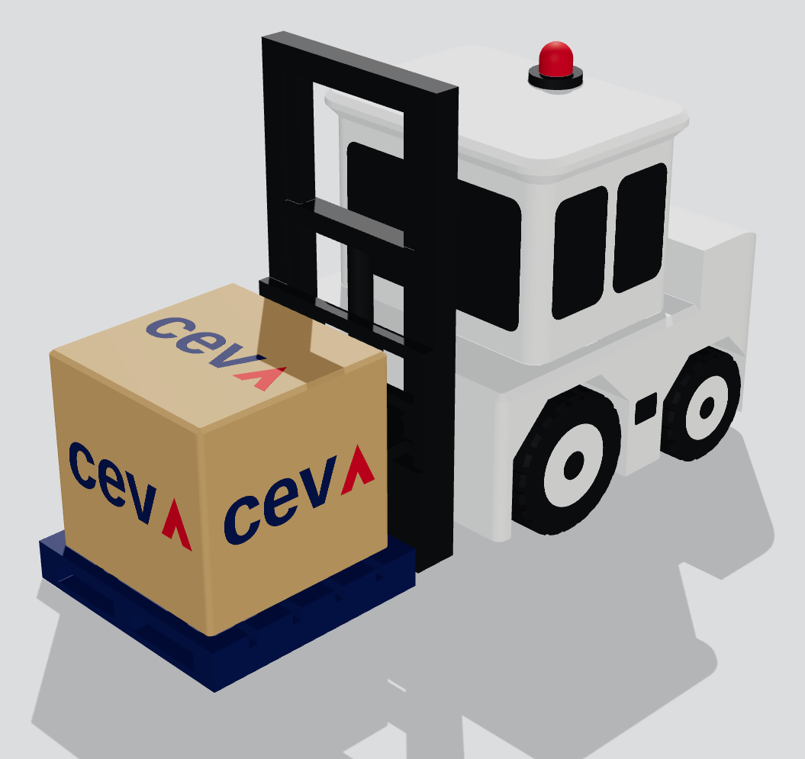
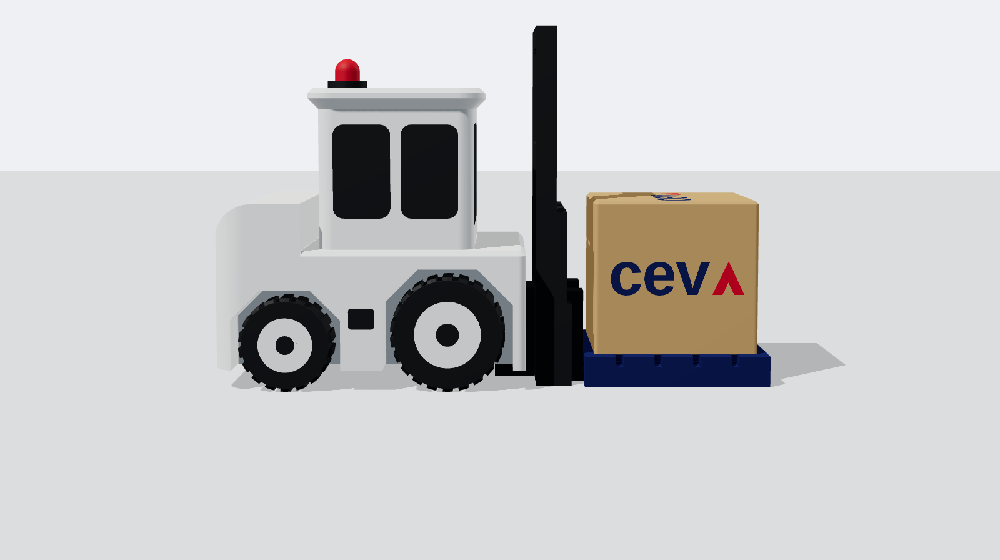
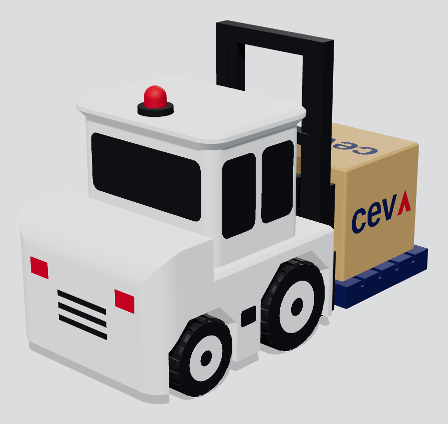
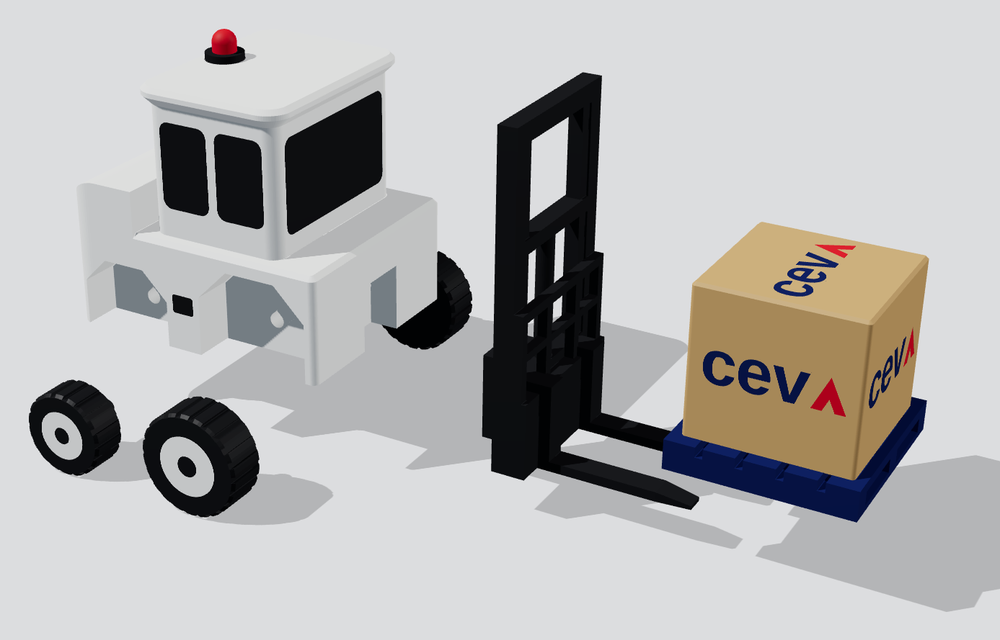

# CEVA: погрузчик с брендированной коробкой (200 шт, Bambu Lab H2C)

Запрос: Lejla Omerbasic Dukic (CEVA Logistics, IMEA). Погрузчик белый, без логотипа.
На вилах коробка с логотипом CEVA. Тираж 200 шт.



| Сбоку | Сзади | Детали |
|---|---|---|
|  |  |  |

**Габарит модели:** 108 × 49 × 70 мм (Д × Ш × В), около 49 г PLA.
Стиль «игрушечный», как на референсе: закрытая кабина с тёмными стёклами, мачта и вилы
чёрные, колёса с белыми дисками, красный маячок и задние фонари. На вилах синий пластиковый
паллет, на нём крафтовая коробка с логотипом на четырёх видимых гранях (перед, бока, верх).

> ⚠️ **Логотип в модели — заглушка** (системный шрифт + красный шеврон вместо «A»).
> Для производства нужен официальный вектор (SVG/AI/EPS) и Pantone от клиента. Его
> подставляют в `logo_navy_2d()` / `logo_red_2d()` в `ceva_forklift.scad` через
> `import("ceva_navy.svg")`. Строка «LOGISTICS» при такой высоте букв (~1,5 мм) соплом 0.4
> не пропечатается; её либо убирают, либо печатают коробку соплом 0.2.

## Детали и печать

Поддержки не нужны нигде: все нависания сделаны под 45° или как короткие мосты,
горизонтальные отверстия каплевидные. Цвета заданы вкладками (inlay) глубиной 0,6–1,0 мм
заподлицо с поверхностью, поэтому ничего не красится и не клеится.

| Файл 3MF | Деталь | Цвета (слоты) | Слой | Заполнение | На стол | Время стола* |
|---|---|---|---|---|---|---|
| `3mf/ceva_forklift_1_body.3mf` | кузов | 1 белый, 2 чёрный (окна, ступени, решётка), 3 красный (фонари, маячок) | 0.20 | Lightning (или Grid 15 %) | 16 | ~12,8 ч |
| `3mf/ceva_forklift_2_load.3mf` | паллет + коробка | 4 крафт, 5 синий (паллет + буквы), 3 красный (шеврон) | 0.16 | Lightning | 42 | ~17,9 ч |
| `3mf/ceva_forklift_3_mast.3mf` | мачта + каретка + вилы | 2 чёрный | 0.20 | Grid 15 % | 40 | ~19,4 ч |
| `3mf/ceva_forklift_4_wheels.3mf` | колёса 2 × Ø22 + 2 × Ø18 | 2 чёрный, 1 белый (диск, первые 3 слоя) | 0.20 | по умолч. | 100 | 8–10,7 ч |
| `3mf/ceva_forklift_SAMPLE_full_kit.3mf` | **весь комплект на одном столе** для образца | все 5 | 0.20 | — | 1 компл. | ~4,5 ч |

\* С запасом +10 % к оценке слайсера, со сменами цвета и 10 мин на снятие стола.

В серии детали печатаются **раздельными столами**: на смешанном столе цвета кузова и коробки
попадают в одни слои. У образца так выходит около 550 смен цвета (~2,5 ч из 4,5 ч),
а на раздельных столах эти смены делятся на 16–100 копий.

**Настройки Bambu Studio:** принтер H2C, все хотэнды 0.4, Textured PEI, пресет
`0.20mm Standard @BBL H2C` (для коробки `0.16mm`), стенки 2, верх 5 слоёв, prime tower
включён. В 3MF каждой части уже назначен слот филамента:
**1 White · 2 Black · 3 Red · 4 Kraft · 5 Navy.** Нужно только выставить филаменты и цвета
в слотах. Распределение по соплам оставить автоматическим; удобно, чтобы основной цвет
стола (белый для кузова, крафт для коробки, чёрный для колёс) шёл через фиксированное сопло,
а остальные через Vortek.
Для производства: загрузить 3MF, затем правый клик → *Fill bed with copies*
(или добавить копии и нажать `A`), освободив место под prime tower.

**Филамент:** рекомендую PLA Matte (матовый скрывает слои и смотрится дороже). Например:
Ivory White, Charcoal, Scarlet Red, Latte Brown / Desert Tan и Dark Blue. Синий подобрать
по Pantone CEVA на образце.

## Сборка (≈3 мин/шт)

1. **Колёса:** капля CA-клея в отверстие оси, вдавить штырь. Большие Ø22 спереди, малые Ø18 сзади.
2. **Мачта:** язычок мачты вставить в паз под передом кузова снизу, капля CA.
   Делать на ровном стекле, чтобы колёса, стойки мачты и вилы касались стола одновременно:
   модель сама выровняется и не будет качаться.
3. **Груз:** надвинуть паллет на вилы (скрытые рёбра центрируют его по вилам), капля CA на вилы.

Зазоры: ось Ø3,0 в отверстии Ø3,2; язычок ±0,2 мм; вилы в рёбрах паллета ±0,25 мм.
Проверить на образце; при необходимости поправить `hole_d` и `fit` в `.scad`.

## Оценка: время и стоимость

Расчёт: `python3 tools/estimate.py`. Все ставки в блоке `PARAMETERS`, их можно поменять.
Время взято из нарезки полных столов (PrusaSlicer 2.7 с профилем, приближённым к
H2C: скорости и ускорения как в `0.20mm Standard @BBL`, `tools/h2c_like.ini`).
К нему добавлены +10 % запаса и смены цвета, посчитанные по слоям из геометрии:
переключение фиксированное сопло ↔ Vortek 15 с, смена хотэнда Vortek 25 с
(около 18 с по обзорам, плюс prime tower).

Печатаем 210 комплектов (200 + 5 % на брак):

| Деталь | шт/стол | столов | мин/шт | г/шт | смен цвета на стол |
|---|---|---|---|---|---|
| Кузов | 16 | 14 | 47,9 | 22,6 | 157 переключений + 1 смена хотэнда |
| Паллет + коробка | 42 | 5 | 25,6 | 10,4 | 50 + 44 |
| Мачта | 40 | 6 | 29,1 | 8,9 | 0 |
| Колесо Ø22 (×2) | 100 | 5 | 6,4 | 2,0 | 4 |
| Колесо Ø18 (×2) | 100 | 5 | 4,8 | 1,3 | 4 |

- **Машинное время:** ≈ **478 ч** на весь заказ (35 столов), ≈ 2,3 ч на комплект.
- **Сроки печати:** 1 × H2C ≈ **22 дня** (22 ч/сутки), 2 принтера ≈ 11 дней,
  3 принтера ≈ 7 дней. Мачта одноцветная, её можно печатать на любом другом принтере.
  Тогда на H2C остаётся ≈ 360 ч.
- **Филамент:** ≈ 10,2 кг: белый 4,2 · чёрный 3,8 · синий 1,3 · крафт 0,9 · красный 0,05.
  Купить: белый 5 кг, чёрный 5 кг, синий 2 кг, крафт 1 кг, красный 1 кг.
- **Ручная работа:** ≈ 20 ч (сборка, контроль, упаковка, смена столов).

**Себестоимость (AED):**

| Статья | Всего | На 1 шт |
|---|---|---|
| Филамент (100 AED/кг) | 1 018 | 5,09 |
| Машинное время (3 AED/ч: амортизация + сервис + электричество) | 1 434 | 7,17 |
| Работа (50 AED/ч) | 979 | 4,90 |
| Клей, расходники | 100 | 0,50 |
| Упаковка (индивидуальная коробочка + пузырка) | 800 | 4,00 |
| **Итого** | **≈ 4 330** | **≈ 21,7** |

**Цена для клиента.** По ставке 12 AED за час принтера, с материалом, работой, упаковкой
и дизайном с образцом (~1 000 AED, разнесено на тираж) выходит ≈ 51 AED/шт.
Рекомендую **65–75 AED/шт**, например **69 AED × 200 = 13 800 AED + 5 % VAT**
(≈ 3 760 USD). Ниже 45 AED/шт опускаться не стоит: не окупается занятость принтера на три недели.

**Сроки для клиента:** образец через 2–3 рабочих дня после получения вектора логотипа.
Тираж через **3–4 недели** после утверждения образца на одном H2C, или **~2 недели**
при двух принтерах.

## Вопросы клиенту (до финальной цены)

1. На референсе флешка (PVC USB). Нужна функция USB или только настольная модель?
   Флешка — это отдельная доработка: модуль UDP в противовесе, ориентировочно +20–25 AED/шт
   и +1 неделя на закупку модулей.
2. Вектор логотипа и Pantone; нужна ли строка «LOGISTICS».
3. Коробка крафтовая: ок, или белая / синяя?
4. Размер ~11 см: ок? Масштаб 90 % сокращает время примерно на 20 %.
5. Упаковка: простая коробочка или брендированная подарочная?
6. Дата и место доставки.

## Черновик ответа клиенту (EN)

> Dear Lejla,
>
> Thank you for your enquiry. Yes, we can produce this.
>
> We have prepared a 3D design based on your reference: a white forklift (no branding) carrying
> a CEVA-branded carton on a pallet. Size approx. 11 × 5 × 7 cm, full-colour 3D print, the logo is
> printed into the carton itself, so it will not peel or fade. Renders attached.
>
> **Quotation, 200 pcs:** AED 69.00 per piece, total AED 13,800 + 5% VAT, including design,
> one pre-production sample, individual packaging and delivery within Dubai.
>
> **Lead time:** sample within 2–3 working days after we receive your logo in vector format
> (AI/EPS/SVG/PDF) with Pantone references; mass production 3–4 weeks after sample approval.
>
> Could you please confirm:
> 1. Is a USB flash-drive function required (as in the reference picture), or a desk model only?
> 2. Preferred carton colour: kraft/brown (as shown), white or CEVA blue?
> 3. Packaging requirements and the required delivery date.
>
> Best regards,
> live3d.ae

## Файлы

```
ceva_forklift.scad      параметрическая модель (OpenSCAD); все размеры в начале файла
stl/                    отдельные цветовые части в ориентации печати (11 шт)
3mf/                    проекты Bambu Studio с назначенными слотами филамента
renders/                превью
tools/export_stl.sh     .scad → stl/
tools/make_3mf.py       stl/ → 3mf/
tools/render.mjs        stl/ → renders/  (Playwright + three.js)
tools/estimate.py       расчёт времени, филамента, себестоимости
tools/h2c_like.ini      профиль PrusaSlicer, по которому нарезались столы для оценки
```

Пересборка: `tools/export_stl.sh && python3 tools/make_3mf.py && python3 tools/estimate.py`
(нужны OpenSCAD 2021+, Python: `trimesh numpy networkx lxml manifold3d`).
